```mermaid
graph LR
    P0[Phase 0<br>Setup] --> P1[Phase 1<br>MVP Core]
    P1 --> P2[Phase 2<br>Full Tools]
    P2 --> P3[Phase 3<br>Accountability]
    P3 --> P4[Phase 4<br>UI Polish]
    P4 --> P5[Phase 5<br>Demo Prep]
    P5 --> P6[Phase 6<br>Hardening]
    P6 --> P7[Phase 7<br>Scale]
    
    style P0 fill:#1e293b,stroke:#64748b,color:#f1f5f9
    style P1 fill:#0f766e,stroke:#2dd4bf,color:#f1f5f9
    style P2 fill:#0f766e,stroke:#2dd4bf,color:#f1f5f9
    style P3 fill:#b45309,stroke:#facc15,color:#f1f5f9
    style P4 fill:#6366f1,stroke:#a5b4fc,color:#f1f5f9
    style P5 fill:#6366f1,stroke:#a5b4fc,color:#f1f5f9
    style P6 fill:#dc2626,stroke:#f87171,color:#f1f5f9
    style P7 fill:#64748b,stroke:#94a3b8,color:#f1f5f9
```

# NagorMind — Phased Development Plan

> **Philosophy**: Build a working MVP first, then layer features incrementally.  
> Each phase produces a **fully functional, demoable** version of the product.  
> Never move to the next phase until the current phase is solid.

---

## Phase Overview

```
Phase 0: Setup & Data Prep           ──→ Environment ready, all data acquired
Phase 1: MVP Core                    ──→ Chat + Map + 3 tools working
Phase 2: Full Tool Suite             ──→ All 13 tools operational  
Phase 3: Accountability Layer        ──→ Tool 13 + flag rendering
Phase 4: UI Polish & UX              ──→ Premium look, animations, mobile
Phase 5: Demo Optimization           ──→ Pre-cached queries, B-roll ready
Phase 6: Testing & Hardening         ──→ Error handling, edge cases
Phase 7: Post-Hackathon (Optional)   ──→ Database, auth, deployment
```



---

## Phase 0: Environment Setup & Data Preparation

> **Goal**: Everything needed to start coding is ready. Zero coding in this phase.  
> **Time Estimate**: 1-2 hours  
> **Deliverable**: Project skeleton, all API keys, all data files, environment verified

### Tasks

#### 0.1 — Project Initialization

- [ ] Create project directory structure:
  ```
  nagormind/
  ├── client/
  │   ├── index.html
  │   ├── style.css
  │   └── src/
  │       └── (empty, files created in Phase 1)
  ├── server/
  │   ├── index.js          (empty placeholder)
  │   ├── agent.js          (empty placeholder)
  │   ├── tools/            (empty directory)
  │   └── prompts/          (empty directory)
  ├── data/                 (filled in this phase)
  ├── scripts/              (pre-fetch scripts)
  ├── .env.example
  ├── .gitignore
  ├── package.json
  └── README.md
  ```
- [ ] Initialize npm: `npm init -y`
- [ ] Create `.gitignore` (include `.env`, `node_modules/`)
- [ ] Initialize git: `git init && git add . && git commit -m "Initial skeleton"`

#### 0.2 — Obtain API Keys

- [ ] **Gemini API Key**: Sign up at https://aistudio.google.com/apikey → test with curl
- [ ] **WAQI Token**: Register at https://aqicn.org/data-platform/token/ → test with Dhaka coords
- [ ] **OpenWeatherMap Key**: Sign up at https://openweathermap.org/api → **do this first** (2hr activation!)
- [ ] Create `.env` file with all 3 keys
- [ ] Verify all 3 APIs respond correctly

#### 0.3 — Acquire Data Files

- [ ] **`data/dhaka_thanas.geojson`**: Download from HDX or Overpass (see External Dependencies doc)
- [ ] **`data/imed_dhaka_projects.json`**: Extract from IMED reports or create realistic sample (~15-30 records)
- [ ] **`data/egp_dhaka_contracts.json`**: Extract from e-GP portal or merge with IMED data
- [ ] **`data/cptu_unit_costs.json`**: Copy template from External Dependencies doc (10 entries)
- [ ] **`data/urban_standards.json`**: Copy template from External Dependencies doc
- [ ] Validate all JSON files parse correctly: `node -e "require('./data/imed_dhaka_projects.json')"`

#### 0.4 — Install Dependencies

- [ ] Server deps: `npm install express ws dotenv @google/generative-ai @turf/turf node-fetch`
- [ ] Verify all install cleanly: `node -e "require('express'); require('ws'); console.log('OK')"`

#### 0.5 — Verify External APIs

- [ ] Test Overpass at https://overpass-turbo.eu/ with Dhaka hospital query
- [ ] Test Nominatim: `curl "https://nominatim.openstreetmap.org/search?q=Mirpur+10+Dhaka&format=json"`
- [ ] Test WAQI: `curl "https://api.waqi.info/feed/geo:23.8103;90.4125/?token=YOUR_TOKEN"`
- [ ] Test OWM: `curl "https://api.openweathermap.org/data/2.5/weather?lat=23.8103&lon=90.4125&appid=YOUR_KEY&units=metric"`

### Acceptance Criteria
- ✅ All 5 data files exist and parse as valid JSON/GeoJSON
- ✅ All 3 API keys work (verified with curl/browser)
- ✅ Nominatim and Overpass respond for Dhaka queries
- ✅ `npm install` completes without errors
- ✅ Project skeleton committed to git

---

## Phase 1: MVP Core — Chat + Map + 3 Basic Tools

> **Goal**: A working split-screen app where you can type a question, the AI calls tools, and results appear on the map.  
> **Time Estimate**: 3-4 hours  
> **Deliverable**: Functional chat → AI → tool → map pipeline with 3 tools

### What This Phase Produces

A user can type "Find hospitals near Mirpur 10" and:
1. The AI geocodes "Mirpur 10"
2. Queries OSM for hospitals
3. Renders markers on the dark-themed map
4. Responds with a summary in the chat

### Tasks

#### 1.1 — Express Server + WebSocket

**File**: `server/index.js`

- [ ] Set up Express server on port 3000
- [ ] Serve static files from `client/` directory
- [ ] Set up WebSocket server on the same port
- [ ] Handle `query` message type from client
- [ ] Send `reasoning`, `tool_call`, `tool_result`, `response`, `error` messages to client
- [ ] Load all data files into memory at startup
- [ ] Implement basic error handling for WebSocket connections

#### 1.2 — Gemini Agent Loop (Minimal)

**File**: `server/agent.js`

- [ ] Initialize Gemini 2.5 Flash client with API key
- [ ] Write system prompt (basic version — just urban planning role, tool usage rules)
- [ ] Implement the agentic loop:
  1. Send user query + system prompt + tool declarations to Gemini
  2. If response contains `functionCall` → execute the tool → append result → call Gemini again
  3. If response contains text → stream back to client
  4. Repeat until no more function calls
- [ ] Declare tool schemas for 3 initial tools (geocode, query_osm_amenities, render_on_map)
- [ ] Stream reasoning steps to WebSocket as they happen

#### 1.3 — Tool 1: `geocode()`

**File**: `server/tools/spatial.js`

- [ ] Implement Nominatim API call
- [ ] Add `User-Agent` header
- [ ] Add 1-second rate limiting
- [ ] Add in-memory cache (24hr TTL)
- [ ] Return `{ lat, lon, display_name, confidence }`
- [ ] Handle "not found" gracefully

#### 1.4 — Tool 2: `query_osm_amenities()`

**File**: `server/tools/spatial.js`

- [ ] Build Overpass QL query from parameters
- [ ] Support types: `hospital`, `clinic`, `school`, `pharmacy`
- [ ] Call Overpass API with 25s timeout
- [ ] Parse response into structured `AmenityResult[]`
- [ ] Return count by type + items list
- [ ] Add 5-minute cache

#### 1.5 — Tool 12: `render_on_map()` (Basic)

**File**: `server/tools/render.js`

- [ ] Accept GeoJSON + style parameters
- [ ] Push `map_render` WebSocket message to client
- [ ] Generate unique layer IDs
- [ ] Support `marker` and `circle` types initially

#### 1.6 — Client: Split-Screen Layout

**File**: `client/index.html` + `client/style.css` + `client/src/app.js`

- [ ] HTML: Split-screen layout (40% chat panel, 60% map)
- [ ] CSS: Dark mode basics (`--bg-primary: #0a0f1e`, Inter font, glass cards)
- [ ] Chat panel: Message thread (scrollable), input bar at bottom
- [ ] Map panel: Leaflet map initialized with CartoDB dark matter tiles, centered on Dhaka
- [ ] WebSocket connection to backend
- [ ] On user submit: send `query` message, display user bubble
- [ ] On `reasoning` message: show thinking indicator
- [ ] On `tool_call` message: show tool badge in chat
- [ ] On `response` message: render AI response as chat bubble
- [ ] On `map_render` message: add GeoJSON to Leaflet map with specified style

#### 1.7 — System Prompt (v1)

**File**: `server/prompts/system_prompt.txt`

- [ ] Write basic role definition (urban planning AI advisor for Dhaka)
- [ ] Tool usage instructions (when to geocode, when to query OSM)
- [ ] Response format guidelines (be specific, cite data, include numbers)
- [ ] Basic safety rules (don't make up data, cite sources)

### Acceptance Criteria
- ✅ App runs with `node server/index.js` and is accessible at `http://localhost:3000`
- ✅ User can type "Find hospitals near Mirpur 10" → AI geocodes → queries OSM → markers appear on map
- ✅ Chat shows reasoning steps + tool badges + final response
- ✅ Map displays markers with proper positioning
- ✅ Error messages display gracefully if API fails
- ✅ Basic dark mode styling applied

### Demo Test Queries for Phase 1
1. "Find hospitals near Mirpur 10" → should show hospital markers
2. "Where are the schools in Dhanmondi?" → should show school markers
3. "Show me clinics within 3km of Gulshan" → should show clinic markers w/ radius circle

---

## Phase 2: Full Tool Suite — All 13 Tools Operational

> **Goal**: Implement remaining 10 tools. Agent can handle any urban planning question.  
> **Time Estimate**: 3-4 hours  
> **Deliverable**: All tools working, agent intelligently selects appropriate tools

### Tasks

#### 2.1 — Spatial Tools (3, 4)

**File**: `server/tools/spatial.js` (add to existing)

- [ ] **Tool 3: `query_osm_infrastructure()`** — Query drains, roads, bridges via Overpass
  - Support types: `drain`, `road`, `bridge`, `waterway`, `culvert`
  - Map each type to correct Overpass tags
  - Calculate total length for linear features
- [ ] **Tool 4: `get_boundary()`** — Lookup thana boundary from local GeoJSON
  - Fuzzy name matching (handle "Mirpur", "mirpur", "Mirpur Thana")
  - Return polygon geometry, area, centroid
  - Fallback to Nominatim if not in local cache

#### 2.2 — Environment Tools (5, 6)

**File**: `server/tools/environment.js`

- [ ] **Tool 5: `get_air_quality()`** — Call WAQI API
  - Parse AQI + individual pollutants
  - Add WHO guideline comparisons
  - Cache for 30 minutes
- [ ] **Tool 6: `get_weather()`** — Call OpenWeatherMap API
  - Get current + 24h forecast
  - Calculate `flood_relevance` fields (recent rain, heavy rain alert)
  - Cache for 15 minutes

#### 2.3 — Analysis Tools (7, 8, 9, 10, 11)

**File**: `server/tools/analysis.js`

- [ ] **Tool 7: `compute_service_coverage()`** — Turf.js coverage analysis
  - Buffer each amenity location with coverage radius
  - Union all buffers
  - Compute coverage % of analysis area
  - Find gap zones (area minus union of buffers)
  - Suggest optimal new facility locations (centroid of largest gap)
- [ ] **Tool 8: `estimate_flood_risk()`** — Composite risk score
  - Query drain density from OSM
  - Get recent rainfall from weather API
  - Find nearest waterway
  - Compute composite score (0-100)
  - Identify vulnerable spots (road segments without nearby drains)
- [ ] **Tool 9: `compare_locations()`** — Multi-tool orchestrator
  - Geocode both locations
  - Run requested metrics (calls other tools internally)
  - Compile side-by-side comparison
  - Generate summary
- [ ] **Tool 10: `estimate_intervention_cost()`** — CPTU lookup
  - Load `cptu_unit_costs.json`
  - Match type + scale
  - Return cost breakdown + timeline
- [ ] **Tool 11: `search_urban_standards()`** — Standards lookup
  - Load `urban_standards.json`
  - Match metric name (fuzzy)
  - Return applicable standards + Dhaka comparison

#### 2.4 — Enhanced Map Rendering (Tool 12)

**File**: `server/tools/render.js` (enhance)

- [ ] Support all geometry types: `polygon`, `polyline`, `heatmap`
- [ ] Support layer groups (toggle on/off)
- [ ] Support `fit_bounds` (auto-zoom to data)
- [ ] Support coverage radius circles
- [ ] Support gap zone polygons (semi-transparent red)

#### 2.5 — Update System Prompt

**File**: `server/prompts/system_prompt.txt` (update)

- [ ] Add descriptions for all 13 tools
- [ ] Add multi-tool orchestration guidelines (when to combine tools)
- [ ] Add metric interpretation rules (what is a "good" AQI, etc.)
- [ ] Add comparison response format
- [ ] Expand safety rules

#### 2.6 — Update Agent Tool Declarations

**File**: `server/agent.js` (update)

- [ ] Add all 13 tool schemas to Gemini function declarations
- [ ] Ensure proper parameter descriptions for each tool

### Acceptance Criteria
- ✅ All 13 tools callable from the agent
- ✅ Agent selects appropriate tools based on natural language query
- ✅ Multi-tool queries work (e.g., compare two locations calls geocode + multiple analysis tools)
- ✅ Map correctly renders all geometry types (markers, circles, polygons, polylines)
- ✅ AQI and weather data display correctly
- ✅ Coverage gap analysis produces meaningful gap zones on the map
- ✅ Flood risk assessment produces a coherent score with cited factors

### Demo Test Queries for Phase 2
1. "What's the air quality in Gulshan right now?" → AQI card + WHO comparison
2. "Compare healthcare access between Mirpur and Dhanmondi" → side-by-side analysis
3. "Assess flood risk in Mohammadpur" → risk score + drain density + vulnerable spots
4. "How much would it cost to build 3 new drains in Pallabi?" → cost breakdown
5. "Show me areas that need more schools in Uttara" → gap zones on map

---

## Phase 3: Accountability Layer — Tool 13 + Flag System

> **Goal**: The differentiating feature. Cross-reference government spending with ground truth.  
> **Time Estimate**: 2-3 hours  
> **Deliverable**: Infrastructure delivery gap analysis with map flags and disclaimer system

### Tasks

#### 3.1 — Tool 13: `check_infrastructure_delivery()`

**File**: `server/tools/accountability.js`

- [ ] Implement `lookupPublicProjects(lat, lon, radius, type)`:
  - Load IMED + e-GP JSON data
  - Filter by location (haversine distance from lat/lon within radius)
  - Filter by project type
  - Return matching projects
- [ ] Implement `estimateFromBudget(budget, type)`:
  - Load CPTU unit costs
  - Calculate expected infrastructure count from budget
- [ ] Implement `calculateGap(osmCount, expectedCount, projects)`:
  - Gap % = (expected - actual) / expected × 100
  - Return gap label: Low/Moderate/High/Very High
- [ ] Assemble full tool:
  1. Lookup public projects
  2. Count actual OSM infrastructure (call `query_osm_infrastructure` internally)
  3. Estimate expected count from budget
  4. Calculate delivery gap
  5. Return structured result with **mandatory disclaimer**
- [ ] Edge cases:
  - No projects found → return message, no gap score
  - OSM count exceeds expected → score 0 (Low), note surplus
  - Budget unknown → estimate from project type average

#### 3.2 — Accountability Flag Rendering

**File**: `client/src/app.js` (add to existing)

- [ ] Handle `accountability_flags` WebSocket message type
- [ ] Render colored flag pins on Leaflet map:
  - 🚩 Red (Very High > 60%)
  - 🔴 Orange (High 40-60%)
  - ⚠️ Yellow (Moderate 20-40%)
  - ✅ Green (Low < 20%)
- [ ] On pin click → show popup with project details:
  - Project name, budget, agency
  - Expected vs. actual count
  - Gap score bar
  - "View Source" link → opens government URL
  - "Ask AI About It" button → sends follow-up query
  - **Disclaimer text** (always visible, amber background)

#### 3.3 — Accountability Panel (Slide-in)

**File**: Client-side (new code section in app.js or new file)

- [ ] Side panel that slides in from right when flags exist
- [ ] Header: "🚩 Accountability Flags" + area name + date range
- [ ] Summary card: projects analyzed, flagged count, total budget
- [ ] Ranked list of flagged projects with gap bars
- [ ] Filter chips: All, Very High, High, Moderate
- [ ] "Export Report" button (generates text summary for copy/paste)
- [ ] Disclaimer banner at bottom

#### 3.4 — Update System Prompt with Accountability Protocol

**File**: `server/prompts/system_prompt.txt` (add section)

- [ ] Add the full Accountability Analysis Protocol (from original plan Part 11)
- [ ] Rules for when to proactively call Tool 13
- [ ] Rules for framing output (anomaly, not accusation)
- [ ] Rules for mandatory disclaimer inclusion
- [ ] Rules for what never to do (name individuals, imply wrongdoing)

#### 3.5 — Suggested Query Chips

**File**: Client-side

- [ ] Add accountability query chip: "🚩 Accountability Check — Mirpur"
- [ ] On click, sends pre-canned query to the agent
- [ ] Chip has amber styling to stand out from others

### Acceptance Criteria
- ✅ Query "Check infrastructure delivery for drainage in Mirpur" → returns gap analysis
- ✅ Flag pins appear on map with correct colors based on gap severity
- ✅ Clicking a flag pin shows popup with all project details + disclaimer
- ✅ Accountability panel slides in with ranked project list
- ✅ Every accountability output includes the full disclaimer text
- ✅ Agent proactively runs Tool 13 when analyzing infrastructure topics
- ✅ When no project data exists for an area, agent states this clearly

### Demo Test Queries for Phase 3
1. "Check public infrastructure delivery for drainage projects in Mirpur" → red flags
2. "Show me delivery gaps in Dhanmondi" → multiple project types checked
3. "Analyze flood infrastructure in Mirpur 10" → agent proactively runs accountability check
4. Click the 🚩 suggested query chip → full accountability report

---

## Phase 4: UI Polish & UX Enhancement

> **Goal**: Transform the functional MVP into a visually stunning, professional-grade UI.  
> **Time Estimate**: 2-3 hours  
> **Deliverable**: Premium dark-mode glassmorphism design with animations

### Tasks

#### 4.1 — Design System Implementation

**File**: `client/style.css` (major overhaul)

- [ ] Implement full design token system (from Figma prompts doc):
  - All color variables
  - Typography scale (heading-xl through caption)
  - Spacing scale
  - Border radii
  - Shadow definitions
- [ ] Glassmorphism cards: `backdrop-filter: blur(16px)`, semi-transparent backgrounds
- [ ] Subtle background grid pattern (CSS grid overlay or SVG)
- [ ] Smooth transitions on all interactive elements (`transition: all 0.2s ease-out`)

#### 4.2 — Chat Panel Polish

- [ ] User message bubbles: right-aligned, cyan gradient background
- [ ] AI response cards: glass card with subtle border, proper padding
- [ ] Tool call badges: indigo pills with monospace font, proper spacing
- [ ] Result badges: green (success) / red (danger) inline results
- [ ] Loading state: pulsing dots + sequential tool call progress animation
- [ ] Disclaimer banners: amber background, non-dismissable
- [ ] Auto-scroll to latest message

#### 4.3 — Map Panel Polish

- [ ] Layer toggle controls: glass-style buttons (top-right)
- [ ] Legend card: bottom-right, collapsible, glass background
- [ ] Smooth zoom transitions
- [ ] Custom marker icons (sized, colored, with shadows)
- [ ] Coverage circle styling: subtle gradient fill + dashed border
- [ ] Gap zone styling: red gradient fill + animated pulse on hover

#### 4.4 — Accountability Panel Polish

- [ ] Slide-in animation (right → left, 300ms ease-out)
- [ ] Progress bars: gradient fill matching severity color
- [ ] Card hover effects: subtle glow + slight scale
- [ ] Scroll indicators
- [ ] Close button with hover state

#### 4.5 — Welcome / Empty State

- [ ] Brain-city icon (large, cyan glow)
- [ ] "Welcome to NagorMind" hero text
- [ ] 4 suggested action cards (2×2 grid, glass style)
- [ ] Powered by credits at bottom

#### 4.6 — Responsive / Mobile

- [ ] Media query breakpoints: 768px, 480px
- [ ] Stack layout vertically on mobile
- [ ] Tab bar for Chat/Map toggle
- [ ] Floating action button for accountability panel
- [ ] Touch-friendly tap targets (min 44px)

#### 4.7 — Micro-Animations

- [ ] Message fade-in on arrival
- [ ] Tool badge slide-in sequentially
- [ ] Gap meter bar animated fill
- [ ] Flag pin drop animation on map
- [ ] Panel slide-in/out transitions
- [ ] Suggested chip hover effects
- [ ] Send button pulse on hover

### Acceptance Criteria
- ✅ Dark mode glassmorphism design throughout
- ✅ All interactions feel smooth (no janky transitions)
- ✅ Loading states are visually polished
- ✅ Disclaimer banners are prominent and styled
- ✅ Mobile layout works on 390px width
- ✅ Welcome state appears when chat is empty
- ✅ Tool badges render inline with proper sizing

---

## Phase 5: Demo Optimization

> **Goal**: Prepare for the hackathon presentation. Pre-cache responses, practice flow.  
> **Time Estimate**: 1-2 hours  
> **Deliverable**: Demo script with pre-cached responses, recorded B-roll

### Tasks

#### 5.1 — Pre-Cache Demo Queries

- [ ] Identify 5-6 demo queries to showcase:
  1. "Find hospitals near Mirpur 10" → basic spatial
  2. "What's the air quality in Gulshan?" → environment
  3. "Assess flood risk in Mohammadpur" → composite analysis
  4. "Compare healthcare between Mirpur and Dhanmondi" → comparison
  5. "Check infrastructure delivery for drainage in Mirpur" → accountability (star moment)
  6. "Show me delivery gaps in Dhanmondi" → full accountability report
- [ ] Run each query once to populate caches
- [ ] Optionally: save full responses as fallback (if Gemini API goes down during demo)
- [ ] Create a "demo mode" flag that uses cached responses if API fails

#### 5.2 — Demo Script

- [ ] Write presenter script (who says what, when):
  - Opening: "What if anyone could ask an AI about their city and get real answers?"
  - Demo 1: Healthcare search (30s) — show map markers appearing
  - Demo 2: Air quality (30s) — show real-time data
  - Demo 3: Flood risk (45s) — show composite analysis, vulnerable spots
  - Demo 4: **Accountability reveal** (60s) — the key differentiator
  - Closing: Impact statement + scalability
- [ ] Time the full demo (target: 4-5 minutes)

#### 5.3 — Demo Safety Net

- [ ] Add graceful degradation: if any API fails, agent still responds with cached data
- [ ] Add "demo starting" console log so you can verify backend is ready
- [ ] Clear all map layers between demo sections
- [ ] Pre-set map zoom/center for each demo query location

#### 5.4 — B-Roll Recording

- [ ] Record the accountability flow as a screen recording (backup for presentation)
- [ ] Screenshot key states: map with flags, accountability panel, gap popup

### Acceptance Criteria
- ✅ All 5-6 demo queries execute under 8 seconds each
- ✅ Demo flows smoothly from query to query without awkward waits
- ✅ Fallback mode works if Gemini API is slow
- ✅ B-roll recorded and saved

---

## Phase 6: Testing & Hardening

> **Goal**: Handle edge cases, prevent crashes, ensure stability during demo.  
> **Time Estimate**: 1-2 hours  
> **Deliverable**: Stable, crash-resistant application

### Tasks

#### 6.1 — Error Handling

- [ ] All external API calls wrapped in try/catch with timeout
- [ ] Overpass timeout: retry once with smaller radius
- [ ] Nominatim failure: inform user, suggest alternative place name
- [ ] Gemini API failure: show "API temporarily unavailable" + retry button
- [ ] WebSocket disconnect: auto-reconnect with exponential backoff
- [ ] Invalid user input: friendly error message, don't crash

#### 6.2 — Rate Limit Protection

- [ ] Nominatim: enforce 1 req/sec queue
- [ ] Track Gemini API usage: warn in console at 80% of daily limit
- [ ] WAQI/OWM: cache aggressively, track remaining calls

#### 6.3 — Input Validation

- [ ] Sanitize user query (strip HTML, limit length to 500 chars)
- [ ] Validate coordinates are within Bangladesh bounding box (20-27°N, 88-93°E)
- [ ] Validate radius_m is reasonable (100-50000m)
- [ ] Validate project_type is in allowed list

#### 6.4 — Edge Case Testing

- [ ] Query about a location outside Dhaka → agent says "I focus on Dhaka..."
- [ ] Query about something non-urban → agent redirects politely
- [ ] Very long query → handled without crashing
- [ ] Rapid multiple queries → queued, not duplicated
- [ ] Empty chat submit → ignored
- [ ] All data files missing → server starts with warnings, tools return "no data"

#### 6.5 — Performance

- [ ] Verify map doesn't lag with 50+ markers
- [ ] Verify chat scroll performance with 20+ messages
- [ ] Verify WebSocket doesn't leak memory (close connections properly)

### Acceptance Criteria
- ✅ No crashes after running 20 continuous queries
- ✅ API failures show user-friendly messages (not stack traces)
- ✅ Rate limits not exceeded in normal usage
- ✅ App recovers from WebSocket disconnect
- ✅ Invalid inputs rejected gracefully

---

## Phase 7: Post-Hackathon Scaling (Optional)

> **Goal**: If you win or want to continue, here's what to build next.  
> **Time Estimate**: Weeks-months  
> **Deliverable**: Production-ready platform

### Tasks

#### 7.1 — Database Layer

- [ ] Add PostgreSQL + PostGIS for spatial queries
- [ ] Migrate pre-fetched JSON into database tables
- [ ] Add live data ingestion pipeline from e-GP portal
- [ ] Add query history storage (anonymized)

#### 7.2 — User Authentication

- [ ] Add user registration/login (NextAuth or Clerk)
- [ ] Role-based access: Citizen, Journalist, Government, Admin
- [ ] Save user query history and favorites
- [ ] Journalist verification badge system

#### 7.3 — Data Pipeline

- [ ] Automated scraping of e-GP portal (weekly)
- [ ] Automated scraping of IMED reports (monthly)
- [ ] OSM infrastructure count refresh (weekly)
- [ ] AQI historical data collection

#### 7.4 — Deployment

- [ ] Deploy backend to Railway / Render (free tier)
- [ ] Deploy frontend to Vercel / Netlify
- [ ] Set up environment variables on hosting platform
- [ ] Add health monitoring (UptimeRobot)
- [ ] Set up error tracking (Sentry free tier)

#### 7.5 — Additional Features

- [ ] Bangla language support (prompts + UI)
- [ ] Ward councillor report generation (PDF export)
- [ ] Historical trend analysis (gap score over time)
- [ ] Community reporting (citizens flag missing infrastructure)
- [ ] Push notifications for new accountability findings
- [ ] Mobile app (React Native wrapper)

---

## Phase Summary & Dependencies

```
Phase 0 ──→ No dependencies. Pure setup.
Phase 1 ──→ Depends on Phase 0 (keys, data, packages)
Phase 2 ──→ Depends on Phase 1 (server, agent loop, basic UI)
Phase 3 ──→ Depends on Phase 2 (all tools, especially Tool 3 for OSM infra)
Phase 4 ──→ Depends on Phase 1 (functional UI exists to polish)
Phase 5 ──→ Depends on Phase 3 (all features to demo)
Phase 6 ──→ Depends on Phase 2 (all code paths exist to test)
Phase 7 ──→ Independent post-hackathon work
```

> [!TIP]
> **Parallel Work Opportunity**: Phase 4 (UI Polish) can overlap with Phase 2/3 if you have a dedicated frontend person. One person builds tools while another polishes CSS.

---

## File Creation Order

This is the exact order to create new files, minimizing rewrites:

| Order | File | Phase | Purpose |
|-------|------|-------|---------|
| 1 | `server/index.js` | 1 | Express + WebSocket server |
| 2 | `server/prompts/system_prompt.txt` | 1 | AI system prompt |
| 3 | `server/tools/spatial.js` | 1 | Tools 1-4 (geocode, OSM queries, boundary) |
| 4 | `server/tools/render.js` | 1 | Tool 12 (map rendering via WebSocket) |
| 5 | `server/agent.js` | 1 | Gemini agentic loop |
| 6 | `client/index.html` | 1 | App shell + Leaflet + fonts |
| 7 | `client/style.css` | 1→4 | Styling (basic in P1, polished in P4) |
| 8 | `client/src/app.js` | 1→4 | Client logic (basic in P1, enhanced in P3-4) |
| 9 | `server/tools/environment.js` | 2 | Tools 5-6 (AQI, weather) |
| 10 | `server/tools/analysis.js` | 2 | Tools 7-11 (coverage, flood, compare, cost, standards) |
| 11 | `server/tools/accountability.js` | 3 | Tool 13 (delivery gap analysis) |
| 12 | `.env.example` | 0 | API key template |
| 13 | `README.md` | 5 | Project documentation |

---

## Quick Start Commands

```bash
# Phase 0: Setup
mkdir nagormind && cd nagormind
mkdir -p client/src server/tools server/prompts data scripts
npm init -y
npm install express ws dotenv @google/generative-ai @turf/turf node-fetch

# Phase 1-3: Development
node server/index.js          # Start backend (port 3000)
# Open http://localhost:3000 in browser

# Phase 5: Demo prep
node server/index.js --demo   # Start with demo mode (cached responses)
```

---

*Each phase is designed to be self-contained and demoable. You can stop after any phase and still have a working product.*
